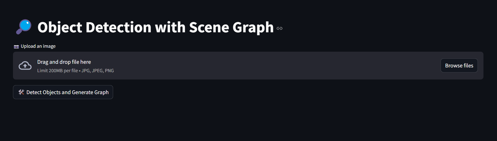

# 🧠 YOLO + ConceptNet Scene Graph Visualizer



This project connects **YOLOv11 object detection** with **ConceptNet** knowledge graph to generate rich, contextual **scene graphs** based on real-world knowledge.

When you upload an image:

- Objects are detected with YOLOv11
- Relevant concepts and relationships between objects are fetched from ConceptNet
- The best relations are selected using **sentence embedding similarity**
- An **interactive scene graph** is generated and displayed

---

## 📚 What is ConceptNet?

[ConceptNet](https://conceptnet.io/) is a freely available semantic network that connects words and phrases of natural language (concepts) with labeled edges (relations). It includes relations like `used_for`, `is_a`, `at_location`, and more.

In this project, ConceptNet helps enrich detected objects with human-like understanding and context-aware reasoning.

---

## 📦 Features

- 🧠 **YOLOv11 object detection** with bounding boxes
- 🌐 **Knowledge graph integration** with ConceptNet
- 🔎 **Semantic filtering** using SentenceTransformers
- 📊 **Interactive scene graph** using Pyvis
- 💡 Easy-to-extend architecture with configurable pipeline

---

## 🛠 Installation & Setup

### 1. Create `config.ini`

```ini
[paths]
data = "path where the ConceptNet RDF data will be stored"

[links]
conceptnet_assertions = https://s3.amazonaws.com/conceptnet/downloads/2019/edges/conceptnet-assertions-5.7.0.csv.gz

[fluseki_server]
fuseki_url = http://localhost:3030
dataset = conceptnet
```

### 2. Install Apache Jena Fuseki

- Download from: [https://jena.apache.org/download/index.cgi](https://jena.apache.org/download/index.cgi)
- Start the Fuseki server
- Create a new dataset named `conceptnet` (or the name you used in config.ini)

### 3. Generate RDF from ConceptNet CSV

```bash
python conceptnet/conceptnet_en_rdf.py
```

This will:

- Download the CSV file from the URL
- Uncompress and clean the data
- Extract English triplets
- Create `conceptnet_en.rdf` in your `data` path

Then upload `conceptnet_en.rdf` to your Fuseki server.

### 4. Install Python dependencies

```bash
pip install -r requirements.txt
```

### 5. Run the app

```bash
streamlit run app.py
```

---

## ⚙️ Technical Details

After object detection, the following steps are performed:

1. **Retrieve all ****`used_for`****, ****`is_a`****, and ****`at_location`**** relations** from ConceptNet using SPARQL queries.
2. If no direct `at_location` is found, the system walks up the `is_a` hierarchy to inherit it from a parent.
3. To handle ambiguity and choose the most relevant `used_for` and `at_location` for each object, the app uses **contextual sentence similarity**.

### 🔎 Semantic Filtering

We use `SentenceTransformer` (`all-MiniLM-L6-v2`) to compute similarity scores between each object-in-context and its candidate relations.

#### Example

If the detected objects are `scissors` and `paper`, then:

- Instead of "paper is used for writing"
- The system infers that "paper is used for **origami**"

This is done via:

```python
context = f"Considering that the image contains scissors, paper, they are likely being used together, and the primary function of paper in this context is"
```

---

## 🧩 Core Functions

### `contextual_choice_of_uses(candidates)`

- Given a dictionary of object -> candidate uses
- Selects the most contextually relevant one using sentence embeddings

### `contextual_choice_of_places(candidates)`

- Picks a globally coherent location assignment across all objects
- Optimized via brute-force search on sentence embedding space

### `get_graph_data(objects)`

- Retrieves relevant triplets for each object
- Falls back to parent concepts if needed
- Cleans and filters the data
- Returns `used_for_result`, `is_a_result`, and `at_location_result`

---

## ✅ Output Example (Triplets)

```
pen         → used_for     → writing
pen         → is_a         → tool
pen         → at_location  → desk
```

